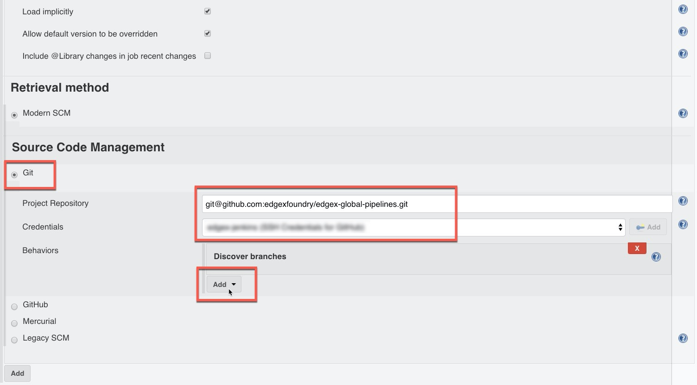

# GitHub Organization Jenkins Plugin Setup

* [GitHub Organization Jenkins Plugin Setup](#github-organization-jenkins-plugin-setup)
  * [Setup Personal Access Token (PAT)](#setup-personal-access-token-pat)
    * [Step 1: Create Personal Access Token](#step-1-create-personal-access-token)
      * [Option 1](#option-1)
      * [Option 2](#option-2)
    * [Step 2: configure the GitHub server](#step-2-configure-the-github-server)
      * [Create Jenkins credentials (PAT)](#create-jenkins-credentials-pat)
      * [Create Jenkins credentials (Webhook shared secret)](#create-jenkins-credentials-webhook-shared-secret)
      * [Configure GitHub Server](#configure-github-server)
    * [Step 3: Configure the Global Library](#step-3-configure-the-global-library)/

## Setup Personal Access Token (PAT)

(skip this step if the user already has a token with the correct permissions)

As the GitHub `edgex-jenkins` user:

### Step 1: Create Personal Access Token

This token will be used for Jenkins to scan the GitHub organization for repositories with Jenkinsfiles. There are two options below to generate the token.

#### Option 1

* Click this link: <https://github.com/settings/tokens/new?scopes=repo,public_repo,admin:repo_hook&description=Jenkins+Access>

* Then click the `Generate Token` button
* Copy the token GitHub provides as you will need it for the next step. The token is only provided once so do not leave the page or you will lose the token.

#### -- or --

#### Option 2

Follow the steps below to create a token:

* Go to: <https://github.com/settings/tokens>
* Click the `Generate New Token` button

* Enter a name and select the following permissions:
`repo`, `admin:repo_hook`

* Then click the `Generate Token` button
* Copy the token GitHub provides as you will need it for the next step. The token is only provided once so do not leave the page or you will lose the token.

---

### Step 2: configure the GitHub server

Configure the GitHub Server on the Jenkins master (skip this step if you already have a configured GitHub server that can mange repo webhooks).

#### Create Jenkins credentials (PAT)

Go to the Jenkins credentials page

* Sandbox: <https://jenkins.edgexfoundry.org/sandbox/credentials/>
* Production: <https://jenkins.edgexfoundry.org/credentials/>

Create credential for Jenkins to scan GitHub

Add a new credential of kind "Secret Text" for the Personal Access Token created from [Step 1](#step-1-create-personal-access-token).

#### Create Jenkins credentials (Webhook shared secret)

Add a new credential of kind "Secret Text" for the shared webhook secret.

This credential is used to authenticate webhook requests. It should not be the same as the personal access token from step 1. It can be any value. If you have openssl installed, you can run this command: `openssl rand -base64 30` to generate random 30 character string.

#### Configure GitHub Server

Navigate to the Jenkins master configure page and configure the **GitHub Server** section

* Sandbox: <https://jenkins.edgexfoundry.org/sandbox/configure>
* Production: <https://jenkins.edgexfoundry.org/configure>

Scroll down to `GitHub` section:

Enter the following details:

* Name: GitHub
* API URL: <https://api.github.com>
* Credential: Select the personal access token created from above
* Check "Manage hooks"
* Click on the **bottom most** `Advanced` button
* Verify webhook URL looks correct, otherwise select `Override Hooks URL`
* Shared Secret: Select the shared webhook secret created from above

Scroll down to the bottom of the screen and click `Save` to save the settings.

---

### Step 3: Configure the Global Library

Navigate to the Jenkins master configure page and configure the **Global Pipeline Libraries** section.

* Sandbox: <https://jenkins.edgexfoundry.org/sandbox/configure>
* Production: <https://jenkins.edgexfoundry.org/configure>

Scroll down to `Global Pipeline Libraries` and click "Add"

**Enter the following details**:

* Name: edgex-global-pipelines
* Default Version: stable
* Check Load Implicitly
* Check Allow default version to be overridden
* **Uncheck** Include @Library changes in job recent changes
* Retrieval Method: Modern SCM

* **Source Code Management**:
  * Select GitHub
  * Credentials: Select or Add new "Username with Password" credential with the Personal Access Token from [Step 1](#step-1-create-personal-access-token)
  * Repository HTTPS URL: <https://github.com/edgexfoundry/edgex-global-pipelines.git>

* **Behaviors**:
  * Discover branches: Exclude branches that are also filed as PRs
  * Discover pull requests from origin: Merging the pull request with the current target branch revision

