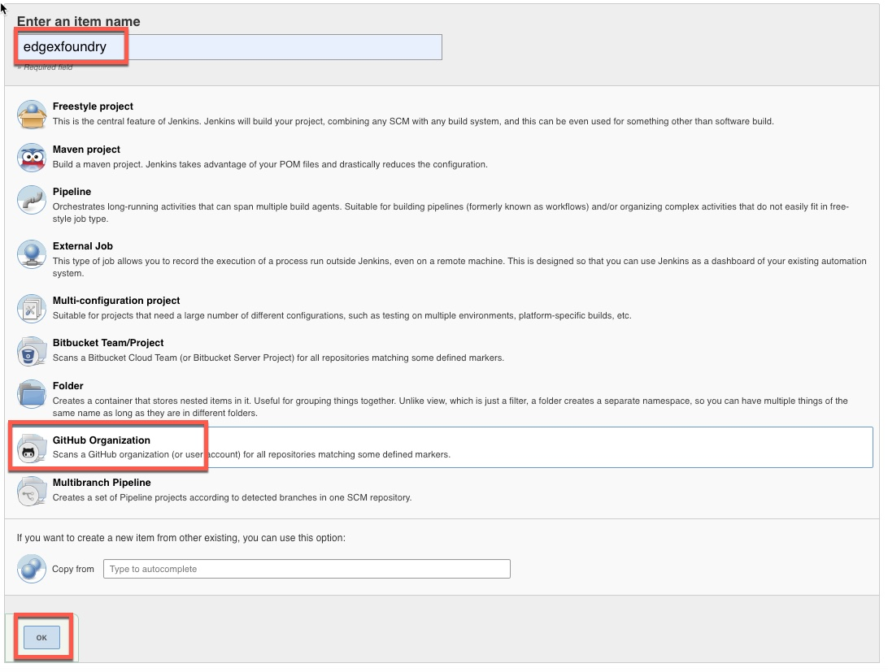
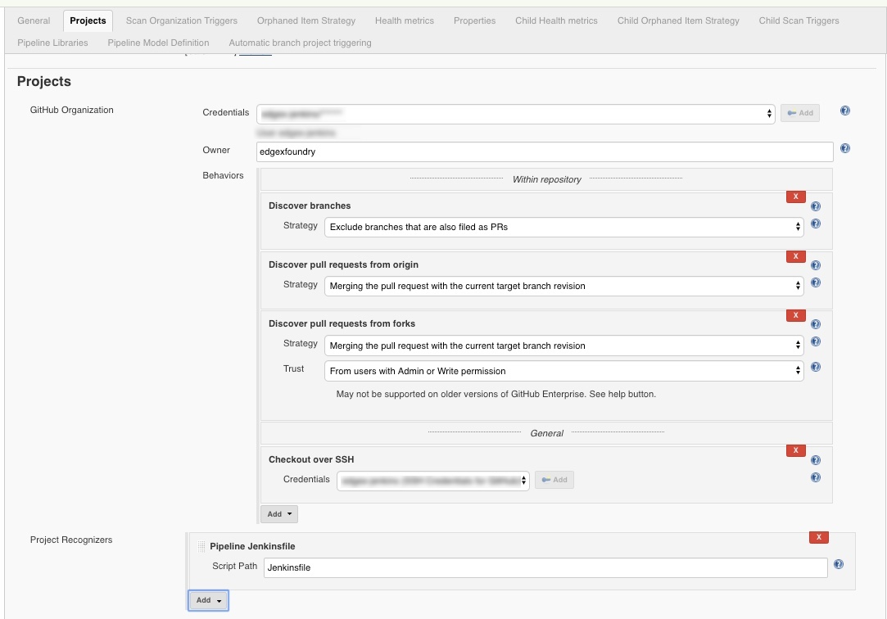
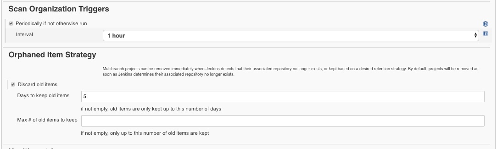
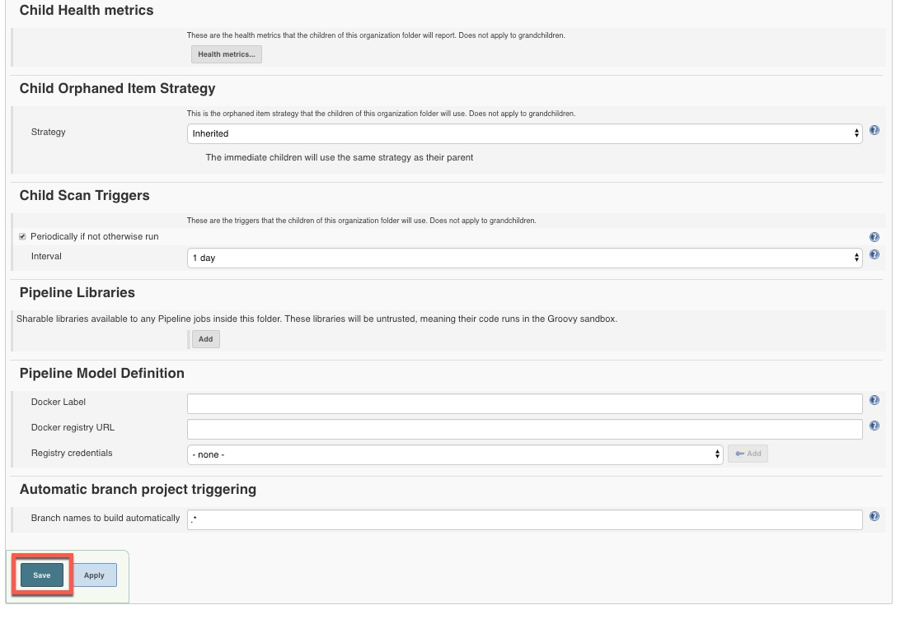
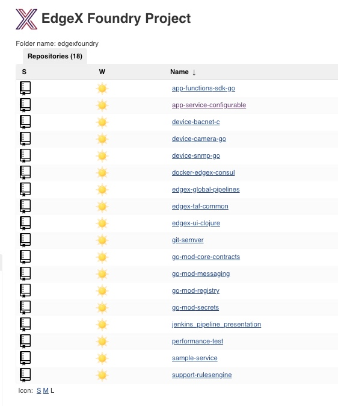

# Create GitHub Organization Job

In order to facilitate automatic scans of GitHub repositories, Jenkins has the job type of `GitHub Organization` that scans a GitHub organization (or user account) for all repositories matching some defined markers. As part of Geneva transformation, the DevOps team would like to move to using this feature. However, Jenkins Job Builder (JJB) does not support the creation of this job type. This document gives instructions on how to configure Jenkins.

## Create Job

* Navigate to: <https://jenkins.edgexfoundry.org/view/All/newJob>
* Name: `edgexfoundry`
* Job Type: `GitHub Organization`

* Click `OK`

## Enter Organization Details

### GitHub Organization

* Credentials: Select PAT token credentials for correct EdgeX GitHub user.
* Owner: `edgexfoundry`
* Discover branches: 
  * Strategy: `Exclude branches that are also filed as PRs`
* Discover pull requests from origin:
  * Strategy: `Merging the pull request with the current target branch revision`
* Discover pull requests from forks:
  * Strategy: `Merging the pull request with the current target branch revision`
  * Trust: `From users with Admin or Write permission`
* Click the "Add" button and select: 'Checkout over SSH'
  * Credentials: Select correct SSH GitHub credentials

### Project Recognizers

* Pipeline Jenkinsfile
  * Script Path: `Jenkinsfile`

### Scan Organization Triggers

* Periodically if not otherwise run: `checked`
* Interval: `4 hours`

### Orphaned Item Strategy

* Discard old items: `checked`
* Days to keep old items: `5`

The rest of the items leave as is. Scroll down to the bottom of the screen and click save.

When the scan is complete you can navigate to the organization folder: <https://jenkins.edgexfoundry.org/view/All/job/edgexfoundry/> and you should see a screen similar to the following:

